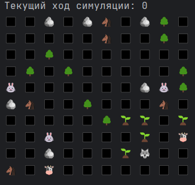

# Симуляция
Этот проект — симуляция мира с существами, 
где травоядные (Herbivores) ищут еду (траву), двигаются по карте и взаимодействуют с окружающей средой. Основная механика включает движение существ, рост еды, для хищников едой, соответственно являются травоядные, для травоядных - трава(Grass.class)
## Основные механики
Для поиска пути используется метод обхода в ширину. Здесь это реализовано следующим образом:
- создаётся Map(Coordinates, Entity), в которой хранятся все сущности и их координаты, пустые клетки ничем не заполняются.
- в цикле перебираются все живые сущности(Creature.class)
- для каждой живой сущности (когда наступает время её хода) составляется карта,
в виде двумерного массива, где 0, это место расположения сущности, которая ходит, отрицательные числа, это клетки занятые другими сущностями,
положительные числа, это количество шагов, необходимых, для того чтобы занять эту клетку.
Например:

